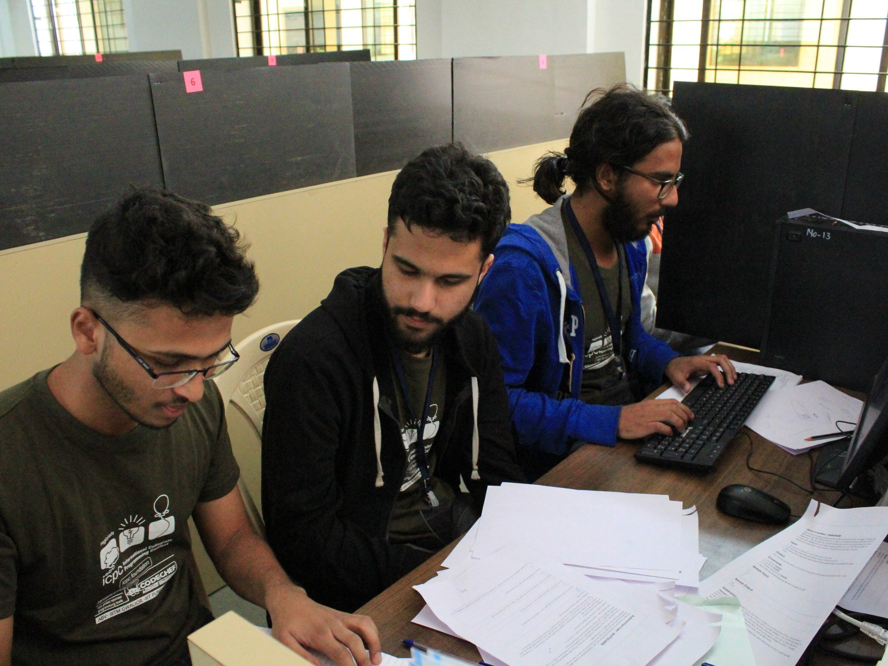

# Competitive Programming

{.ui .right .floated .medium .image}

I did a lot of competitive programming mostly in the first two years of my bachelors. Thanks to a lot of practice, I went to the **ICPC World finals** twice (2018, 2019) with my good friends [Bhavit Sharma][7] and [Prateek Karnal][8] as part of the team **ButterRoti**.

I followed the book [Competitive Programming 3][2] and am eternally grateful to Felix Halim and Steven Halim for this gem.
I mostly practiced on [Codeforces][6] and used C++ as my primary language. I also used [Uhunt (Uva)][3], [SPOJ][4] and [Codechef][5].

These days I solve problems occasionally to get better at Haskell and on my todo list is getting more people to do Competitive Programming in Haskell.
Contact me if this is something you would like to collaborate on.

You can check out my competitive programming journal for a non-exhaustive lit of problem that I solved and to get an idea of the kind of practice I did.
- [[[cp2017]]]
- [[[cp2018]]]

I also maintain an almost exhaustive repository of all of my solutions [here][1]. The repo has around **88K LoC**!(although the actual amount of code I wrote is a bit less than that since every file has a small starter template as well)

[1]: https://github.com/sureyeaah/Competitive/
[2]: http://cpbook.net
[3]: https://uhunt.onlinejudge.org/id/858471
[4]: https://www.spoj.com/users/gear4/ 
[5]: https://www.codechef.com/users/gear4
[6]: https://codeforces.com/profile/sureyeaah
[7]: https://www.linkedin.com/in/bhavit-sharma
[8]: https://www.linkedin.com/in/karnalprateek
